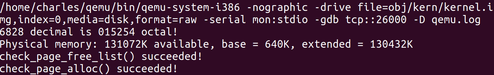
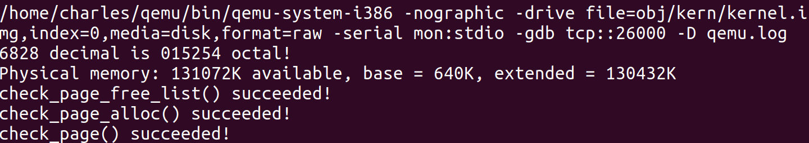
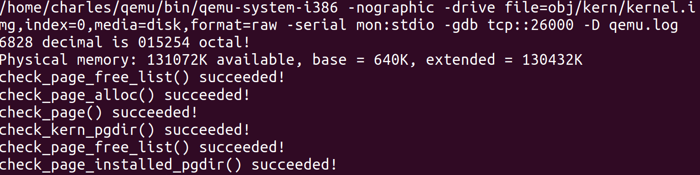
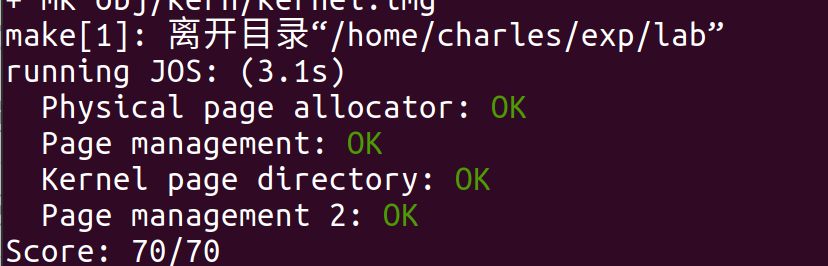

# Lab 2 Report——内存管理

[TOC]

## 实验内容

1. 获取新代码
2. 实现`/kern/pmap.c`一些函数——内存分配初始化
3. 实现`/kern/pmap.c`一些函数——页表管理
4. 完善`/kern/pmap.c`中`mem_init()`函数

## 实验步骤

### 1.拉取新代码

git命令如下

```shell
git pull
git checkout -b lab2 origin/lab2
git merge lab1
```

### 2. 实现`/kern/pmap.c`一些函数——内存分配初始化

这些函数主要实现了页式管理中对空闲内存的初始化、分配、释放等工作，下面是具体实现代码及注释

#### 1.`boot_alloc()`函数

临时内存分配函数，`page`分配器初始化之前，使用这个函数为`pages`数组分配内存，实现如下：

```c
static void *
boot_alloc(uint32_t n)
{
	static char *nextfree;	// virtual address of next byte of free memory
	char *result;
	// Initialize nextfree if this is the first time.
	// 'end' is a magic symbol automatically generated by the linker,
	// which points to the end of the kernel's bss segment:
	// the first virtual address that the linker did *not* assign
	// to any kernel code or global variables.

	if (!nextfree) {
		extern char end[];
		nextfree = ROUNDUP((char *) end, PGSIZE);
	}
    
	// Allocate a chunk large enough to hold 'n' bytes, then update
	// nextfree.  Make sure nextfree is kept aligned
	// to a multiple of PGSIZE.
	//
	// LAB 2: Your code here.
    
	// special case

	if(n == 0)
	{
		return nextfree;
	}

	// allocate memory 
	result = nextfree;
	nextfree = ROUNDUP(n,PGSIZE)+nextfree;

	// out of memory panic
	if((uint32_t)nextfree-KERNBASE>(npages*PGSIZE))
	{
		panic("at boot_alloc(): out of memory");
        
        // reset the nextfree
		nextfree = result;
		return NULL;
	}
	return result;

}
```

#### 2.`page_alloc()`&`page_free()`函数

之所以把这两个函数放在一起，是因为这两个函数涉及均涉及链表操作

`page_alloc()`函数用于分配空闲页，实际上就是删除空闲链表中的第一项，同时要把内存中相应的部位用'\0'填充。函数实现如下

```c
struct PageInfo *
page_alloc(int alloc_flags)
{
	// Fill this function in
    
	// no free page
	if(page_free_list == NULL)
	{
		return NULL;
	}
    
	// allocated page
	struct PageInfo* alloc = page_free_list;
    
	// delete allocated page
	page_free_list = page_free_list->pp_link;

	// set NULL according to note
	alloc->pp_link = NULL;

	// fills the entire returned physical page with '\0' bytes.
	char* head = page2kva(alloc);
	if(alloc_flags & ALLOC_ZERO)
	{
		memset(head,0,PGSIZE);
	}
	return alloc;

}


```

`page_free()`和上一个相反，用来释放页，也就是在空闲页表中添加一项，函数实现如下

```c
void
page_free(struct PageInfo *pp)
{
	// Fill this function in
	// Hint: You may want to panic if pp->pp_ref is nonzero or
	// pp->pp_link is not NULL.
    
	// panic conditions
	if(pp->pp_ref != 0 | pp->pp_link != NULL)  // referenced or freed
	{
		panic("at pmap.c:page_free(): Page double free or freeing a referenced page");
	}
    
	// free page
	pp->pp_link = page_free_list;
	page_free_list = pp;

}


```

#### 3. `page_init()`函数

这个函数需要我们做这些事情：

1. 将0号页标记为不可用
2. 其他基础内存为空闲
3. IOhole不可分配
4. extend memory 有一部分正在使用（实际上是内核）剩下为空闲

实现如下：

```c
void
page_init(void)
{
	// The example code here marks all physical pages as free.
	// However this is not truly the case.  What memory is free?
	//  1) Mark physical page 0 as in use.
	//     This way we preserve the real-mode IDT and BIOS structures
	//     in case we ever need them.  (Currently we don't, but...)
	//  2) The rest of base memory, [PGSIZE, npages_basemem * PGSIZE)
	//     is free.
	//  3) Then comes the IO hole [IOPHYSMEM, EXTPHYSMEM), which must
	//     never be allocated.
	//  4) Then extended memory [EXTPHYSMEM, ...).
	//     Some of it is in use, some is free. Where is the kernel
	//     in physical memory?  Which pages are already in use for
	//     page tables and other data structures?
	//
	// Change the code to reflect this.
	// NB: DO NOT actually touch the physical memory corresponding to
	// free pages!

	// IO hole page number
	size_t num_iohole = (EXTPHYSMEM-IOPHYSMEM)/PGSIZE;
    
	// used extmem
	size_t num_used = ((uint32_t)boot_alloc(0)-EXTPHYSMEM-KERNBASE)/PGSIZE;
	for(size_t i = 0;i<npages;i++)
	{
		// requirement 1)
		if(i == 0)
		{
			pages[i].pp_ref = 1;
		}

		// requirement 3) and part of 4)
		else if(i>=npages_basemem && i<npages_basemem+num_iohole+num_used)
		{
			pages[i].pp_ref = 1;
		}

		// rest requirements
		else
		{
			pages[i].pp_ref = 0;
			pages[i].pp_link = page_free_list;
			page_free_list = &pages[i];
		}

	}

}
```

 此部分函数测试结果：



`check_page_free_list()`及`check_page_alloc()`测试通过

### 3. 实现`/kern/pmap.c`一些函数——页表管理

#### 1.`pgdir_walk()函数`

这个函数给定一个页目录表指针pgdir ，返回线性地址va所对应的页表项指针。实现如下：

```c
pte_t *
pgdir_walk(pde_t *pgdir, const void *va, int create)
{
	// Fill this function in
    
	// basic variables
	unsigned int page_offset;
	pte_t* page_base = NULL;
	struct PageInfo* new_page = NULL;
    
	// page dir address
	unsigned int dir_offset = PDX(va);
	pde_t* entry = pgdir+dir_offset;

	// if not in main memory
	if(!(*entry & PTE_P))
	{
	 	// if create
		if(create)
		{
	 		// allocate new page
			new_page = page_alloc(1);
			if(new_page == NULL)
			{
				return NULL;
			}
			new_page->pp_ref++;
			*entry = ((page2pa(new_page))|PTE_P|PTE_W|PTE_U);
		}
		else
		{
			return NULL;
		}

	}
    
    // get the result
	page_base = (pte_t*)KADDR(PTE_ADDR(*entry));
	page_offset = PTX(va);
	return &page_base[page_offset];

}
```

#### 2.`boot_map_region()`函数

这个函数将一段虚拟地址空间映射到物理地址空间中，并存放到相应的页表中，实现如下：

```c
static void
boot_map_region(pde_t *pgdir, uintptr_t va, size_t size, physaddr_t pa, int perm)
{
	// Fill this function in
	int add;
	pte_t* entry = NULL;
    
	// map the physical addr to virtual addr
	for(add = 0;add<size;add+=PGSIZE)
	{
		entry = pgdir_walk(pgdir,(void*)va,1);  // get the entry of page table
		*entry = (pa|perm|PTE_P);
		pa+=PGSIZE;
		va+=PGSIZE;
	}


```

#### 3. `page_insert()`函数

这个函数将物理内存中的页和虚拟内存地址建立映射关系，实现如下：

```c
int
page_insert(pde_t *pgdir, struct PageInfo *pp, void *va, int perm)
{
	// Fill this function in
	pte_t* entry = NULL;
	entry = pgdir_walk(pgdir,va,1); // get the page table entry 
	if(entry == NULL)
	{
		return -E_NO_MEM;
	}
	pp->pp_ref++;
	
	// if the virtual address is mapped
	if(*entry&PTE_P)
	{
		// invalidate the TLB
		tlb_invalidate(pgdir,va);
		// remove page 
		page_remove(pgdir,va);
	}
	// insert into page table
	*entry = ((page2pa(pp))|perm|PTE_P);
	pgdir[PDX(va)] |= perm;
	return 0;
}
```

#### 4. `page_lookup()`函数

这个函数返回虚拟地址映射的页的指针，并将其存储，实现如下：

```c
struct PageInfo *
page_lookup(pde_t *pgdir, void *va, pte_t **pte_store)
{
	// Fill this function in

	// get the page table entry
	pte_t* entry = NULL;
	entry = pgdir_walk(pgdir,va,0);
	// not mapped
	if(entry == NULL)
	{
		return NULL;
	}

	// not in main memory
	if(!(*entry & PTE_P))
	{
		return NULL;
	}

	// map it to the page
	struct PageInfo* ret = pa2page(PTE_ADDR(*entry));
	
	// store to pte_store
	if(pte_store != NULL)
	{
		*pte_store = entry;
	}
	return ret;
}
```

#### 5. `page_remove()`函数

这个函数删除虚拟地址和物理页的映射关系，实现如下：

```c
void
page_remove(pde_t *pgdir, void *va)
{
	// Fill this function in
	pte_t* pte = NULL;
	struct PageInfo* page = page_lookup(pgdir,va,&pte);
	
	// not mapped
	if(page == NULL)
	{
		return;
	}
	// some operations afterwards

	// decrease the pp_ref field
	page_decref(page);
	// invalidate the TLB
	tlb_invalidate(pgdir,va);
	*pte = 0;
}
```

测试结果：



`check_page()`测试通过

### 4. 完善`/kern/pmap.c`中`mem_init()`函数

之前看到的测试函数`check_*`都在`mem_init()`中被调用，而`mem_init()`函数被内核`i386_init()`函数调用。这将是完成内存管理的最后一步，前面写好的函数`boot_map_region()`将在此调用。

1. 首先映射`pages`数组，线性地址为`UPAGES`，大小为`PTSIZE`,权限为内核读写，用户只读，函数调用如下：

```c
boot_map_region(kern_pgdir,UPAGES,PTSIZE,PADDR(pages),PTE_U);
```

2. 再映射内核栈`bootstack`数组，用户不可读写，调用如下：

```c
boot_map_region(kern_pgdir,KSTACKTOP-KSTKSIZE,KSTKSIZE,PADDR(bootstack),PTE_W);
```

3. 再映射其余的地址，用户不可读写，调用如下：

```c
boot_map_region(kern_pgdir,KERNBASE,0xFFFFFFFF-KERNBASE,0,PTE_W);
```

测试结果如下



通过了所有的测试函数。

至此 Lab 2 结束

执行`make grade`结果如下：



## 实验收获

1. 体会物理地址向虚拟地址映射的过程
2. 体会页表管理的过程
3. 体会物理页向虚拟地址转换的过程

#### 参考资料

[[1]](https://zhuanlan.zhihu.com/p/168787600)

[[2]](https://www.cnblogs.com/fatsheep9146/p/5079930.html)

