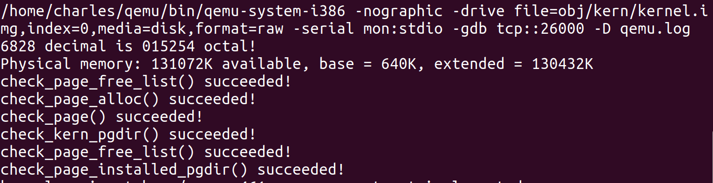
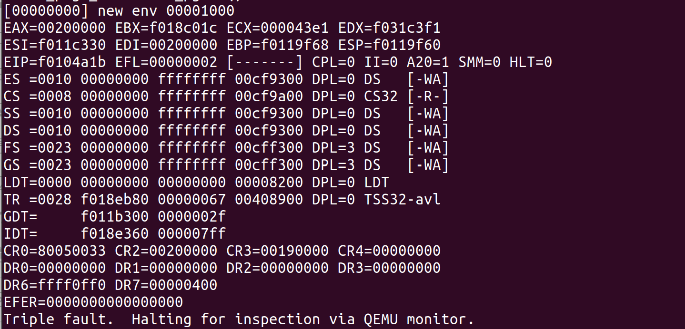
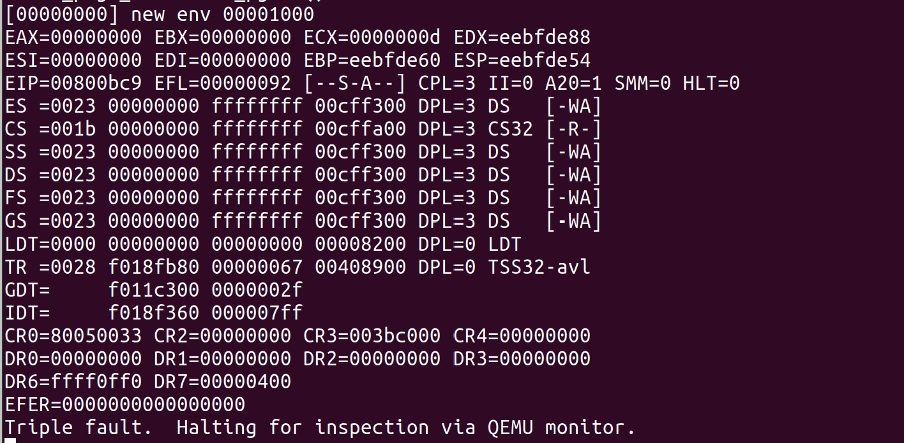
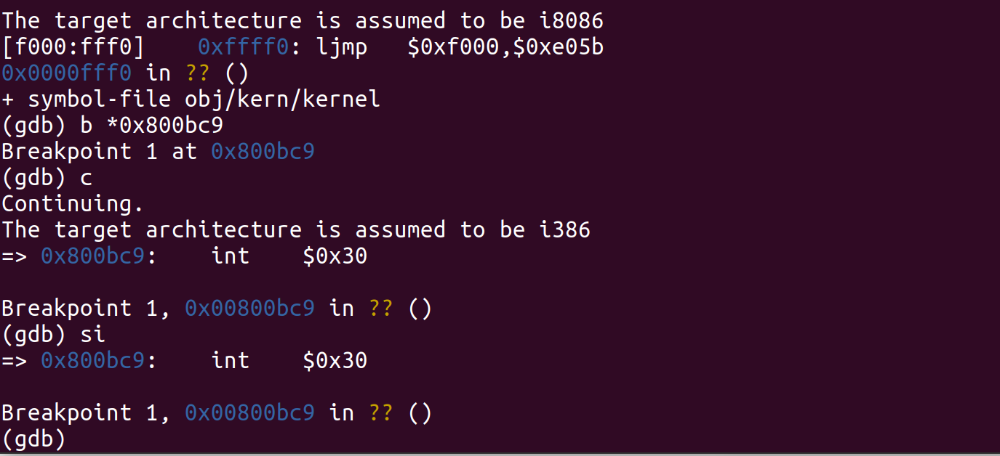
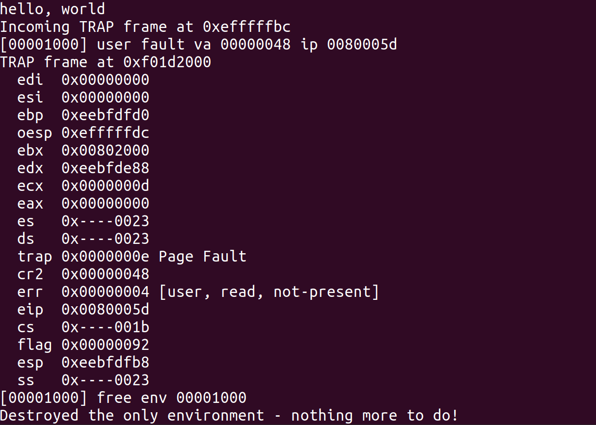
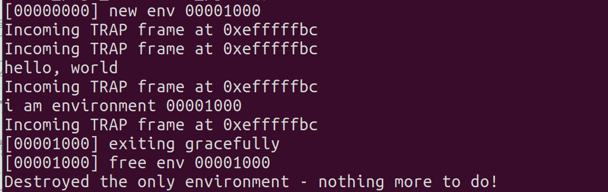
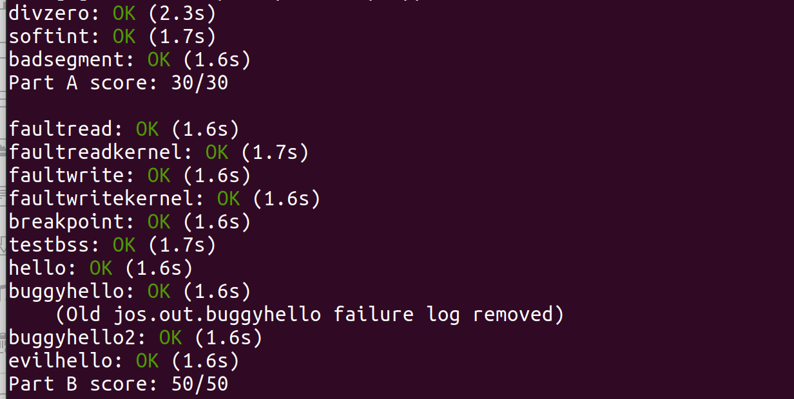

# Lab 3 Report——用户环境（进程初始化+中断+陷阱）

[TOC]

## 实验内容

1. 为`envs`分配存储空间并映射
2. 实现`kern/env.c`的一些函数——用户环境初始化及运行
3. 中断初始化
4. 分发中断
5. 系统调用
6. 用户环境准备
7. 缺页错误及内存保护

## 实验步骤

### 1. 为`envs`分配存储空间并映射

模仿Lab 2中为`pages`分配空间并映射的步骤，为`envs`分配空间并映射。在`mem_init()`中添加的代码为

```c
// Make 'envs' point to an array of size 'NENV' of 'struct Env'.
	// LAB 3: Your code here.
	envs = (struct Env*)boot_alloc(NENV*sizeof(struct Env));
	memset(envs,0,NENV*sizeof(struct Env));
```

以及

```c
boot_map_region(kern_pgdir,UENVS,PTSIZE,PADDR(envs),PTE_U);	
```

这使得代码能够通过新的`check_kern_pgdir()`函数，结果如下：



**从Lab2 合并之后出现的问题及解决：**

问题：在执行`mem_init()`函数的时候，会报奇怪的错误

`kernel panic at kern/pmap.c:162: PADDR called with invalid kva 00000000`

解决方案：参考了[这篇博客](https://blog.csdn.net/qq_42779423/article/details/108853781)，解决方法是将`kern/kernel.ld`的`.bss`部分改为

```
.bss : {
		PROVIDE(edata = .);
		*(.bss)
		BYTE(0)
	}
	PROVIDE(end = .);
```

就可以了

### 2. 实现`kern/env.c`的一些函数——用户环境初始化及运行

#### 1. `env_init()`函数

这个函数是将`envs`中所有数组加入`env_free_list`链表中，由于要求链表的顺序与数组的顺序一样，要采用头插法，即从数组的最后一个元素开始，每个元素插入到链表的头部,实现如下：

```c
void
env_init(void)
{
	// Set up envs array
	// LAB 3: Your code here.
	env_free_list = NULL;
    // using head-insert to ensure the order in the same way
	for(int i = NENV - 1; i>=0 ;i--)
	{
		envs[i].env_id = 0;
		envs[i].env_status = ENV_FREE;
		envs[i].env_link = env_free_list;
		env_free_list = &envs[i];
	}

	// Per-CPU part of the initialization
	env_init_percpu();
}
```

#### 2. `env_setup_vm()`函数

这个函数初始化新的用户环境的页目录表，并且仅设置与操作系统内核相关的页目录项，其中，`UTOP`之下的初始虚拟地址为空。实现如下：

```c
static int
env_setup_vm(struct Env *e)
{
	int i;
	struct PageInfo *p = NULL;

	// Allocate a page for the page directory
	if (!(p = page_alloc(ALLOC_ZERO)))
		return -E_NO_MEM;

	// Now, set e->env_pgdir and initialize the page directory.
	//
	// Hint:
	//    - The VA space of all envs is identical above UTOP
	//	(except at UVPT, which we've set below).
	//	See inc/memlayout.h for permissions and layout.
	//	Can you use kern_pgdir as a template?  Hint: Yes.
	//	(Make sure you got the permissions right in Lab 2.)
	//    - The initial VA below UTOP is empty.
	//    - You do not need to make any more calls to page_alloc.
	//    - Note: In general, pp_ref is not maintained for
	//	physical pages mapped only above UTOP, but env_pgdir
	//	is an exception -- you need to increment env_pgdir's
	//	pp_ref for env_free to work correctly.
	//    - The functions in kern/pmap.h are handy.

	// LAB 3: Your code here.
	e->env_pgdir = (pde_t*)page2kva(p);
	p->pp_ref++;

	// below UTOP
	for(int i = 0;i<PDX(UTOP);i++)
	{
		e->env_pgdir[i] = 0;
	}

	// above UTOP
	for(int i = PDX(UTOP);i<NPDENTRIES;i++)
	{
		e->env_pgdir[i] = kern_pgdir[i];
	}
	
	// UVPT maps the env's own page table read-only.
	// Permissions: kernel R, user R
	e->env_pgdir[PDX(UVPT)] = PADDR(e->env_pgdir) | PTE_P | PTE_U;

	return 0;
}
```

#### 3. `region_alloc()`函数

这个函数为用户环境分配物理空间，可以逐页进行分配，并且在分配失败时要进行`panic`操作，实现如下：

```c
static void
region_alloc(struct Env *e, void *va, size_t len)
{
	// LAB 3: Your code here.
	// (But only if you need it for load_icode.)
	//
	// Hint: It is easier to use region_alloc if the caller can pass
	//   'va' and 'len' values that are not page-aligned.
	//   You should round va down, and round (va + len) up.
	//   (Watch out for corner-cases!)
	void* start = (void*)ROUNDDOWN((uint32_t)va,PGSIZE);
	void* end = (void*)ROUNDUP((uint32_t)va+len,PGSIZE);

	// corner case 1: too large length
	if(start>end)
	{
		panic("At region_alloc: too large length\n");
	}
	struct PageInfo* p = NULL;

	// allocate PA by the size of a page
	for(void* v = start;v<end;v+=PGSIZE)
	{
		p = page_alloc(0);
		// corner case 2: page allocation failed
		if(p == NULL)
		{
			panic("At region_alloc: Page allocation failed");
		}

		// insert into page table
		int insert = page_insert(e->env_pgdir,p,v,PTE_W|PTE_U);

		// corner case 3: insertion failed
		if(insert!=0)
		{
			panic("At region_alloc: Page insertion failed");
		}
	}
}
```

#### 4.`load_icode()`函数

这个函数加载一个二进制ELF文件，重点在解析ELF文件。实现如下，大部分实现细节在Hint里，我们需要注意的就是用`lcr3()`函数进行用户页表与内核页表的切换：

```c
static void
load_icode(struct Env *e, uint8_t *binary)
{
	// Hints:
	//  Load each program segment into virtual memory
	//  at the address specified in the ELF segment header.
	//  You should only load segments with ph->p_type == ELF_PROG_LOAD.
	//  Each segment's virtual address can be found in ph->p_va
	//  and its size in memory can be found in ph->p_memsz.
	//  The ph->p_filesz bytes from the ELF binary, starting at
	//  'binary + ph->p_offset', should be copied to virtual address
	//  ph->p_va.  Any remaining memory bytes should be cleared to zero.
	//  (The ELF header should have ph->p_filesz <= ph->p_memsz.)
	//  Use functions from the previous lab to allocate and map pages.
	//
	//  All page protection bits should be user read/write for now.
	//  ELF segments are not necessarily page-aligned, but you can
	//  assume for this function that no two segments will touch
	//  the same virtual page.
	//
	//  You may find a function like region_alloc useful.
	//
	//  Loading the segments is much simpler if you can move data
	//  directly into the virtual addresses stored in the ELF binary.
	//  So which page directory should be in force during
	//  this function?
	//
	//  You must also do something with the program's entry point,
	//  to make sure that the environment starts executing there.
	//  What?  (See env_run() and env_pop_tf() below.)

	// LAB 3: Your code here.
	// convert to Elf
	struct Elf* elfHeader = (struct Elf*) binary;

	// corner case 1: Invalid head magic number
	if(elfHeader->e_magic != ELF_MAGIC)
	{
		panic("At load_icode: Invalid head magic number");
	}
    
    // switch to user page directory
	lcr3(PADDR(e->env_pgdir));
	// load each segment
	struct Proghdr* ph = (struct Proghdr*)(binary+elfHeader->e_phoff);
	struct Proghdr* phEnd = ph+elfHeader->e_phnum;
	for(;ph<phEnd;ph++)
	{

		// go as hint says
		if(ph->p_type == ELF_PROG_LOAD)
		{
			// corner case 2: file size too big
			if(ph->p_filesz>ph->p_memsz)
			{
				panic("At load_icode: file size bigger than memory size");
			}
            
			// allocate space 
			region_alloc(e,(void*) ph->p_va,ph->p_memsz);

			// copy to VA
			memcpy((void*)ph->p_va,binary+ph->p_offset,ph->p_filesz);

			// set the rest to 0
			memset((void*)(ph->p_va+ph->p_filesz),0,ph->p_memsz-ph->p_filesz);
		}

	// switch back to kernel address mappings
	lcr3(PADDR(kern_pgdir));
	// set runnable
	e->env_status = ENV_RUNNABLE;
	// set trapframe entry
	e->env_tf.tf_eip = elfHeader->e_entry;

	// Now map one page for the program's initial stack
	// at virtual address USTACKTOP - PGSIZE.

	// LAB 3: Your code here.
	region_alloc(e,(void*)(USTACKTOP-PGSIZE),PGSIZE);
    
```

#### 5. `env_create()`函数

这个函数是利用前面实现的函数进行用户环境的创建，实现如下：

``` c
void
env_create(uint8_t *binary, enum EnvType type)
{
	// LAB 3: Your code here.
	struct Env* e;
	int alloc = env_alloc(&e,0);
	if(alloc != 0)
	{
		panic("At env_create: env_alloc() failed");
	}
	load_icode(e,binary);
	e->env_type = type;
}
```

#### 6. `env_run()`函数

这个函数用于启动用户环境，进行上下文切换，实现如下：

```c
void
env_run(struct Env *e)
{
	// Step 1: If this is a context switch (a new environment is running):
	//	   1. Set the current environment (if any) back to
	//	      ENV_RUNNABLE if it is ENV_RUNNING (think about
	//	      what other states it can be in),
	//	   2. Set 'curenv' to the new environment,
	//	   3. Set its status to ENV_RUNNING,
	//	   4. Update its 'env_runs' counter,
	//	   5. Use lcr3() to switch to its address space.
	// Step 2: Use env_pop_tf() to restore the environment's
	//	   registers and drop into user mode in the
	//	   environment.

	// Hint: This function loads the new environment's state from
	//	e->env_tf.  Go back through the code you wrote above
	//	and make sure you have set the relevant parts of
	//	e->env_tf to sensible values.

	// LAB 3: Your code here.

	// panic("env_run not yet implemented");

	// step 1
	// set the env_status field
	if(curenv)
	{
		if(curenv->env_status == ENV_RUNNING)
		{
			curenv->env_status = ENV_RUNNABLE;
		}
	}
    
	// switch to new environment
	curenv = e;
	curenv->env_status = ENV_RUNNING;
	curenv->env_runs++;
	// switch to user page directory
	lcr3(PADDR(curenv->env_pgdir));
    
	// step 2
	env_pop_tf(&curenv->env_tf);


}
```

此时再编译运行，就会进入用户环境，但是会出现一个triple fault 的问题，后面会解决。目前运行结果如下



**上图实际上是有问题的，它在错误的位置引发了triple fault**，经过查阅资料和gdb调试，发现在`load_icode()`函数中忘记用`lcr3()`函数切换到用户页表，现在已经加上了。正确结果如下图：



打断点发现无法执行下面的指令：



### 3. 中断初始化

中断处理要求我们解决2中出现的Triple Fault问题,也就是实现用户态到内核态的切换。具体工作如下：

#### 1. 完善`trapentry.S`的代码

需要补充的部分是不同中断的入口以及一个`_alltraps`函数，代码如下：

```assembly
/*
 * Lab 3: Your code here for generating entry points for the different traps.
 */

/* 
   2 macros are provided while TRAPHANDLER pushes an error code with interrupt number and TRAPHANDLER_NOEC
   pushes a 0 with interrupt number
*/
TRAPHANDLER_NOEC(DIVIDE,T_DIVIDE)
TRAPHANDLER_NOEC(DEBUG,T_DEBUG)
TRAPHANDLER_NOEC(NMI, T_NMI)
TRAPHANDLER_NOEC(BRKPT, T_BRKPT)
TRAPHANDLER_NOEC(OFLOW, T_OFLOW)
TRAPHANDLER_NOEC(BOUND, T_BOUND)
TRAPHANDLER_NOEC(ILLOP, T_ILLOP)
TRAPHANDLER_NOEC(DEVICE, T_DEVICE)
TRAPHANDLER(DBLFLT, T_DBLFLT)
TRAPHANDLER(TSS, T_TSS)
TRAPHANDLER(SEGNP, T_SEGNP)
TRAPHANDLER(STACK, T_STACK)
TRAPHANDLER(GPFLT, T_GPFLT)
TRAPHANDLER(PGFLT, T_PGFLT)
TRAPHANDLER_NOEC(FPERR, T_FPERR)
TRAPHANDLER(ALIGN, T_ALIGN)
TRAPHANDLER_NOEC(MCHK, T_MCHK)
TRAPHANDLER_NOEC(SIMDERR, T_SIMDERR)
TRAPHANDLER_NOEC(SYSCALL, T_SYSCALL)
TRAPHANDLER_NOEC(DEFAULT, T_DEFAULT)

/*
 * Lab 3: Your code here for _alltraps
 */
 .global _alltraps
 _alltraps:
 /* code below according to the guide */
pushl %ds
pushl %es
pushal
movw $GD_KD, %ax
movw %ax, %ds
movw %ax, %es
pushl %esp
call trap

```

#### 2. 实现`trap.c`中`trap_init()`函数

这个函数初始化所有类型的中断描述符表，同时注册函数，实现如下：

```c
void
trap_init(void)
{
	extern struct Segdesc gdt[];

	// LAB 3: Your code here.
    // initialize idt
	void DIVIDE();
    SETGATE(idt[T_DIVIDE], 0, GD_KT, DIVIDE, 0);

	void DEBUG();
	SETGATE(idt[T_DEBUG], 0, GD_KT, DEBUG, 0);

	void NMI();
	SETGATE(idt[T_NMI], 0, GD_KT, NMI, 0);

	void BRKPT();
	SETGATE(idt[T_BRKPT], 1, GD_KT, BRKPT, 3);

	void OFLOW();
	SETGATE(idt[T_OFLOW], 0, GD_KT, OFLOW, 0);

	void BOUND();
	SETGATE(idt[T_BOUND], 0, GD_KT, BOUND, 0);

	void ILLOP();
	SETGATE(idt[T_ILLOP], 0, GD_KT, ILLOP, 0);

	void DEVICE();
	SETGATE(idt[T_DEVICE], 0, GD_KT, DEVICE, 0);

	void DBLFLT();
	SETGATE(idt[T_DBLFLT], 0, GD_KT, DBLFLT, 0);

	void TSS();
	SETGATE(idt[T_TSS], 0, GD_KT, TSS, 0);

	void SEGNP();
	SETGATE(idt[T_SEGNP], 0, GD_KT, SEGNP, 0);

	void STACK();
	SETGATE(idt[T_STACK], 0, GD_KT, STACK, 0);

	void GPFLT();
	SETGATE(idt[T_GPFLT], 0, GD_KT, GPFLT, 0);

	void PGFLT();
	SETGATE(idt[T_PGFLT], 0, GD_KT, PGFLT, 0);

	void FPERR();
	SETGATE(idt[T_FPERR], 0, GD_KT, FPERR, 0);

	void ALIGN();
	SETGATE(idt[T_ALIGN], 0, GD_KT, ALIGN, 0);

	void MCHK();
	SETGATE(idt[T_MCHK], 0, GD_KT, MCHK, 0);

	void SIMDERR();
	SETGATE(idt[T_SIMDERR], 0, GD_KT, SIMDERR, 0);

	void SYSCALL();
	SETGATE(idt[T_SYSCALL], 1, GD_KT, SYSCALL, 3);

	void DEFAULT();
	SETGATE(idt[T_DEFAULT], 0, GD_KT, DEFAULT, 0);


	// Per-CPU setup 
	trap_init_percpu();
}

```

#### 3. 回答问题

问题1：由于不同的中断有不同的处理方式，在写`trapentry.S`的代码时就会发现处理某些中断时会压入错误码，某些则压入0，如果采用同一套handler处理，则会增加程序的复杂度，且无法判断中断的类型。

问题2：当前的系统正处于用户态，特权级为3，而`int`指令特权级为0，用户态不能调用此指令，则会触发trap13。如果允许用户自行引发page fault 则操作系统容易被攻击。

### 4. 分发中断

讲义中要求我们实现`trap_dispatch()`函数以处理缺页错误、断点调试等中断，直接调用函数即可，实现如下：

```c
static void
trap_dispatch(struct Trapframe *tf)
{
	// Handle processor exceptions.
	// LAB 3: Your code here.
	switch(tf->tf_trapno)
	{
		case T_PGFLT:
		{
			page_fault_handler(tf);
			return;
		}
		case T_BRKPT:
		{
			monitor(tf);
			return;
		}
		case T_DEBUG:
		{
			monitor(tf);
			return;
		}
		
	}
	// Unexpected trap: The user process or the kernel has a bug.
	print_trapframe(tf);
	if (tf->tf_cs == GD_KT)
		panic("unhandled trap in kernel");
	else {
		env_destroy(curenv);
		return;
	}
}
```

### 5. 系统调用

此处要实现在用户态下工作调用系统调用时，也能够正常运行，不发生中断。需要在前面的基础上实现`kern/syscall.c`中的`syscall()`函数，以及在`trap_dispatch()`中增加一种情况，实现如下

```c
// in 'kern/syscall.c'
int32_t
syscall(uint32_t syscallno, uint32_t a1, uint32_t a2, uint32_t a3, uint32_t a4, uint32_t a5)
{
	// Call the function corresponding to the 'syscallno' parameter.
	// Return any appropriate return value.
	// LAB 3: Your code here.

	// panic("syscall not implemented");

	// function called varies with the syscallno
	switch (syscallno) 
	{
		case SYS_cputs:
		{
			sys_cputs((const char*)a1,(size_t)a2);
			return 0;
		}
		case SYS_cgetc:
		{
			return sys_cgetc();
		}
		case SYS_env_destroy:
		{
			return sys_env_destroy((envid_t)a1);
		}
		case NSYSCALLS:
		{
			return 0;
		}
		default:
			return -E_INVAL;
	}
}

// in "kern/trap.c"
static void
trap_dispatch(struct Trapframe *tf)
{
	// Handle processor exceptions.
	// LAB 3: Your code here.
	switch(tf->tf_trapno)
	{
		case T_PGFLT:
		{
			page_fault_handler(tf);
			return;
		}
		case T_BRKPT:
		{
			monitor(tf);
			return;
		}
		case T_DEBUG:
		{
			monitor(tf);
			return;
		}
		case T_SYSCALL:
		{
			struct PushRegs* regs = &(tf->tf_regs);
			int32_t ret = syscall(regs->reg_eax,regs->reg_edx,regs->reg_ecx,regs->reg_ebx,regs->reg_edi,regs->reg_esi);
			regs->reg_eax = (uint32_t)ret;
			return;
		}
		
	}

```

### 6. 用户环境准备

上一个部分做完之后，运行时还是会报错，如下所示：



这是因为在打印出"hello, world"之后，系统尝试获取`env-id`，但是失败了，添加下面的代码可以解决。

```c
// in "lib/libmain.c" function libmain()

// set thisenv to point at our Env structure in envs[].
	// LAB 3: Your code here.
	thisenv = 0;
	envid_t id = sys_getenvid();
	thisenv = &envs[ENVX(id)];

// in "kern/syscall.c" function syscall() a new situation

case SYS_getenvid:
{
	return sys_getenvid();
}

```

运行结果



### 7. 缺页错误及内存保护

这一部分要实现缺页错误的处理以及内存权限的检查（即内存保护）

#### 1. 缺页处理

实现很简单，按提示添加代码如下，检查`tf_cs`的低位与`0x03`（用户态标志）做与运算是否为0：

```c
// Handle kernel-mode page faults.

	// LAB 3: Your code here.
	// check low-bits of tf_cs
	if((tf->tf_cs & 3) == 0)
	{
		panic("At page_fault_handler: page fault at %08x.\n",fault_va);
	}
```

#### 2. 内存保护

主要是实现`kern/pmap.c`中的`user_mem_check()`函数，按提示实现如下

```c
int
user_mem_check(struct Env *env, const void *va, size_t len, int perm)
{
	// LAB 3: Your code here.
	bool check = true;
	pde_t* pgdir = env->env_pgdir;
	uintptr_t address = (uintptr_t)va;
	perm = perm | PTE_U | PTE_P;
	pte_t* entry = NULL;
	for(; address<(uintptr_t)(va+len);address+=PGSIZE)
	{
		// overflow
		if(address>=ULIM)
		{
			check = false;
			break;
		}

		// table entry doesn't exist
		if(page_lookup(pgdir,(void*)address,&entry) == NULL)
		{
			check = false;
			break;
		}

		// no permission
		if(!(*entry & perm))
		{
			check = false;
			break;
		}
	}

	// fault happens and set user_mem_check_addr to 
	if(!check)
	{
		user_mem_check_addr = (address == (uintptr_t)va ? address : ROUNDDOWN(address,PGSIZE));
		return -E_FAULT;
	}
	return 0;
}
```

然后在`kdebug.c`中调用这个函数，不再赘述。

至此Lab 3结束，测评结果如下：



## 实验收获

这个实验最主要的工作就是用户环境的初始化、中断处理、缺页处理、内存保护，其中，初始化的工作类似Lab 2，中断处理的工作实际上就是理论课上讲的目态与管态之间的切换以及现场的保存，它分为初始化、分发和系统调用3个步骤。，实验中用C语言代码实现了这个功能。让我加深了对这个知识点的理解，在代码实现中，核心是IDT表的设置。缺页处理主要是处理内存缺页的问题，内存保护则是阻止用户访问系统内存。

#### 参考资料

[[1]](https://www.cnblogs.com/fatsheep9146/category/769143.html)

[[2]](https://zhuanlan.zhihu.com/p/166413604)