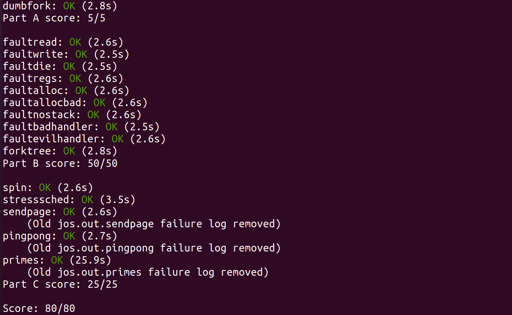

# Lab 4 Report——抢占式多任务（进程管理）

[TOC]

## 实验内容

1. 多处理器支持
2. 轮转法调度
3. 创建环境的系统调用
4. 用户级缺页错误处理
5. 实现"Copy-on-write-fork"
6. 时钟中断和抢占
7. 进程间通信（IPC）

## 实验步骤

### 1. 多处理器支持

#### 1. AP(Application Processor)启动

就是实现`kern/pmap.c`中的`mmio_map_region()`函数，这个函数将LAPIC（Local Advanced Programmable Interrupt Controller）使用的MMIO（Memory-Mapped I/O）映射到虚拟地址上，同时要将新占用的页进行标记，实现如下：

```c
// in "kern/pmap.c"
void *
mmio_map_region(physaddr_t pa, size_t size)
{
	// Where to start the next region.  Initially, this is the
	// beginning of the MMIO region.  Because this is static, its
	// value will be preserved between calls to mmio_map_region
	// (just like nextfree in boot_alloc).
	static uintptr_t base = MMIOBASE;

	// Reserve size bytes of virtual memory starting at base and
	// map physical pages [pa,pa+size) to virtual addresses
	// [base,base+size).  Since this is device memory and not
	// regular DRAM, you'll have to tell the CPU that it isn't
	// safe to cache access to this memory.  Luckily, the page
	// tables provide bits for this purpose; simply create the
	// mapping with PTE_PCD|PTE_PWT (cache-disable and
	// write-through) in addition to PTE_W.  (If you're interested
	// in more details on this, see section 10.5 of IA32 volume
	// 3A.)
	//
	// Be sure to round size up to a multiple of PGSIZE and to
	// handle if this reservation would overflow MMIOLIM (it's
	// okay to simply panic if this happens).
	//
	// Hint: The staff solution uses boot_map_region.
	//
	// Your code here:
	// panic("mmio_map_region not implemented");
	size = ROUNDUP(pa+size,PGSIZE);
	pa = ROUNDDOWN(pa,PGSIZE);
	size-=pa;
	if(size+base>=MMIOLIM)
	{
		panic("At mmio_map_region(): overflow MMIOLIM");
	}
	boot_map_region(kern_pgdir,base,size,pa,PTE_W|PTE_PCD|PTE_PWT);
	base+=size;
	return (void*)(base-size);
}

// in function page_init() add

// map MPENTRY_PADDR as used
	size_t mpentry = MPENTRY_PADDR/PGSIZE;
// map the MPENTRY as used
		else if(i == mpentry)
		{
			pages[i].pp_ref = 1;
			pages[i].pp_link = NULL;
		}
```

#### 2. 分CPU状态及初始化

这个部分把所有CPU的地址进行映射并处理多CPU状态下的陷阱(trap)，代码实现如下：

```c
// in "kern/pmap.c"
static void
mem_init_mp(void)
{
	// Map per-CPU stacks starting at KSTACKTOP, for up to 'NCPU' CPUs.
	//
	// For CPU i, use the physical memory that 'percpu_kstacks[i]' refers
	// to as its kernel stack. CPU i's kernel stack grows down from virtual
	// address kstacktop_i = KSTACKTOP - i * (KSTKSIZE + KSTKGAP), and is
	// divided into two pieces, just like the single stack you set up in
	// mem_init:
	//     * [kstacktop_i - KSTKSIZE, kstacktop_i)
	//          -- backed by physical memory
	//     * [kstacktop_i - (KSTKSIZE + KSTKGAP), kstacktop_i - KSTKSIZE)
	//          -- not backed; so if the kernel overflows its stack,
	//             it will fault rather than overwrite another CPU's stack.
	//             Known as a "guard page".
	//     Permissions: kernel RW, user NONE
	//
	// LAB 4: Your code here:
	for(int i = 0;i<NCPU;i++)
	{
		uintptr_t kstacktop_i = (KSTACKTOP-KSTKSIZE)-i*(KSTKSIZE+KSTKGAP);
		physaddr_t pa = PADDR(percpu_kstacks[i]);
		boot_map_region(kern_pgdir,kstacktop_i,KSTKSIZE,pa,PTE_W|PTE_P);
	}

}

// in "kern/trap.c"
// modified by the hint
// Hints:
	//   - The macro "thiscpu" always refers to the current CPU's
	//     struct CpuInfo;
	//   - The ID of the current CPU is given by cpunum() or
	//     thiscpu->cpu_id;
	//   - Use "thiscpu->cpu_ts" as the TSS for the current CPU,
	//     rather than the global "ts" variable;
	//   - Use gdt[(GD_TSS0 >> 3) + i] for CPU i's TSS descriptor;
	//   - You mapped the per-CPU kernel stacks in mem_init_mp()
	//   - Initialize cpu_ts.ts_iomb to prevent unauthorized environments
	//     from doing IO (0 is not the correct value!)
	//
	// ltr sets a 'busy' flag in the TSS selector, so if you
	// accidentally load the same TSS on more than one CPU, you'll
	// get a triple fault.  If you set up an individual CPU's TSS
	// wrong, you may not get a fault until you try to return from
	// user space on that CPU.
	//
	// LAB 4: Your code here:
	// Setup a TSS so that we get the right stack
	// when we trap to the kernel.
	uint8_t id = thiscpu->cpu_id;
	thiscpu->cpu_ts.ts_esp0 = KSTACKTOP-id*(KSTKSIZE+KSTKGAP);
	thiscpu->cpu_ts.ts_ss0 = GD_KD;
	thiscpu->cpu_ts.ts_iomb = sizeof(struct Taskstate);

	// Initialize the TSS slot of the gdt.
	gdt[(GD_TSS0 >> 3)+id] = SEG16(STS_T32A, (uint32_t) (&thiscpu->cpu_ts),
					sizeof(struct Taskstate) - 1, 0);
	gdt[(GD_TSS0 >> 3)+id].sd_s = 0;

	// Load the TSS selector (like other segment selectors, the
	// bottom three bits are special; we leave them 0)
	ltr(GD_TSS0+(id<<3));

	// Load the IDT
	lidt(&idt_pd);
```

运行结果如下：


### 2. 轮转法调度

#### 1. 锁函数调用

这一部分在一些函数中调用`lock_kernel()`及`unlock_kernel()`来实现加锁以及释放锁，类似于理论课上的信号量机制，只不过这个锁只是一个互斥信号量，共4处调用如下：

```c
// in "kern/init.c" function i386_init()

// Acquire the big kernel lock before waking up APs
// Your code here:
	lock_kernel();
// Starting non-boot CPUs
	boot_aps();

// in "kern/init.c" function mp_main()

// Now that we have finished some basic setup, call sched_yield()
// to start running processes on this CPU.  But make sure that
// only one CPU can enter the scheduler at a time!
//
// Your code here:
	lock_kernel();
	sched_yield();

// in "kern/trap.c" function trap()

if ((tf->tf_cs & 3) == 3) {
	// Trapped from user mode.
	// Acquire the big kernel lock before doing any
	// serious kernel work.
	// LAB 4: Your code here.
		lock_kernel();
		assert(curenv);

// in "kern/env.c" function env_run() the position of this function is vital

// switch to user page directory
	lcr3(PADDR(curenv->env_pgdir));
	unlock_kernel();
// step 2
	env_pop_tf(&curenv->env_tf);
```


#### 2. 轮转法调度(RR)函数实现

轮转法调度相较FCFS,SJF等方法，理论课上提得较少，实验正好弥补了这一块，这个函数的主要思想是从当前环境（如果存在）开始，循环地查找`envs`数组，直到找到一个可以运行的环境为止。实现如下：

```c
void
sched_yield(void)
{
	struct Env *idle;

	// Implement simple round-robin scheduling.
	//
	// Search through 'envs' for an ENV_RUNNABLE environment in
	// circular fashion starting just after the env this CPU was
	// last running.  Switch to the first such environment found.
	//
	// If no envs are runnable, but the environment previously
	// running on this CPU is still ENV_RUNNING, it's okay to
	// choose that environment.
	//
	// Never choose an environment that's currently running on
	// another CPU (env_status == ENV_RUNNING). If there are
	// no runnable environments, simply drop through to the code
	// below to halt the cpu.
	// LAB 4: Your code here.
	// start point of searching
	int begin = 0;
	// flag
	bool flag = false;
	if(curenv)
	{
		begin = ENVX(curenv->env_id);
	}
	// search the next runnable env(R&R)
	for(int i = 0;i<NENV;i++)
	{
		idle = &envs[(i+begin)%NENV];
		if(idle->env_status == ENV_RUNNABLE)
		{
			flag = true;
			env_run(idle);
			break;
		}
	}
	if(!flag && curenv && curenv->env_status == ENV_RUNNING)
	{
		env_run(curenv);
	}
	// sched_halt never returns
	if(!flag)
	{
		sched_halt();
	}
}

```

测试成功，达到多用户环境互斥运行的效果：


### 3. 创建环境的系统调用

这一部分实现一系列系统调用函数，实际除了前两个函数之外，都是Lab 2中有关页及页表管理函数的系统调用封装，写的时候主要进行一些边界条件判断（在注释中给出），调用Lab 2中实现的接口即可。各个函数实现如下：

**`sys_exofork()`函数**

```c
static envid_t
sys_exofork(void)
{
	// Create the new environment with env_alloc(), from kern/env.c.
	// It should be left as env_alloc created it, except that
	// status is set to ENV_NOT_RUNNABLE, and the register set is copied
	// from the current environment -- but tweaked so sys_exofork
	// will appear to return 0.

	// LAB 4: Your code here.
	// panic("sys_exofork not implemented");
	struct Env* store_env = NULL;
	// allocate environment
	int ret = env_alloc(&store_env,curenv->env_id);
	if(ret < 0)
	{
		return ret;
	}
	// set attributes according to hint
	store_env->env_status = ENV_NOT_RUNNABLE;
	store_env->env_tf = curenv->env_tf;
	store_env->env_tf.tf_regs.reg_eax = 0;
	return store_env->env_id;
}
```

**`sys_env_set_status()`函数**

```c
static int
sys_env_set_status(envid_t envid, int status)
{
	// Hint: Use the 'envid2env' function from kern/env.c to translate an
	// envid to a struct Env.
	// You should set envid2env's third argument to 1, which will
	// check whether the current environment has permission to set
	// envid's status.

	// LAB 4: Your code here.
	// panic("sys_env_set_status not implemented");
	if(status != ENV_NOT_RUNNABLE && status!= ENV_RUNNABLE)
	{
		return -E_INVAL;
	}
	struct Env* e = NULL;
	int ret = envid2env(envid,&e,true);
	if(ret < 0)
	{
		return ret;
	}
	e->env_status = status;
	return 0;
}
```

**`sys_page_alloc()`函数**

```c
static int
sys_page_alloc(envid_t envid, void *va, int perm)
{
	// Hint: This function is a wrapper around page_alloc() and
	//   page_insert() from kern/pmap.c.
	//   Most of the new code you write should be to check the
	//   parameters for correctness.
	//   If page_insert() fails, remember to free the page you
	//   allocated!

	// LAB 4: Your code here.
	// panic("sys_page_alloc not implemented");
	// -E_INVAL if va >= UTOP, or va is not page-aligned.
	if((uintptr_t)va >= UTOP || (uintptr_t)va % PGSIZE)
	{
		return -E_INVAL;
	}
	
	// -E_INVAL if perm is inappropriate
	int needed_perm = PTE_U|PTE_P;
	if((perm & ~(PTE_SYSCALL)) || ((perm & needed_perm) != needed_perm))
	{
		return -E_INVAL;
	}

	struct Env* e = NULL;
	int ret = envid2env(envid,&e,true);
	if(ret<0)
	{
		return ret;
	}
	struct PageInfo* pg = page_alloc(ALLOC_ZERO);
    
	// -E_NO_MEM if there's no memory to allocate the new page
	if(!pg)
	{
		return -E_NO_MEM;
	}

	// or to allocate any necessary page tables
	ret = page_insert(e->env_pgdir,pg,va,perm);
	if(ret < 0)
	{
		page_free(pg);
		return ret;
	}
	return 0;

}
```

**`sys_page_map()`函数**

```c
sys_page_map(envid_t srcenvid, void *srcva,
	     envid_t dstenvid, void *dstva, int perm)
{
	// Hint: This function is a wrapper around page_lookup() and
	//   page_insert() from kern/pmap.c.
	//   Again, most of the new code you write should be to check the
	//   parameters for correctness.
	//   Use the third argument to page_lookup() to
	//   check the current permissions on the page.
	// LAB 4: Your code here.
	// panic("sys_page_map not implemented");
	if((uintptr_t)srcva>=UTOP || (uintptr_t)srcva % PGSIZE 
	|| (uintptr_t)dstva>=UTOP || (uintptr_t)dstva % PGSIZE)
	{
		return -E_INVAL;
	}

	int needed_perm = PTE_U|PTE_P;
	if((perm & ~(PTE_SYSCALL)) || ((perm & needed_perm) != needed_perm))
	{
		return -E_INVAL;
	}

	struct Env* srce = NULL, *dste = NULL;
	int ret = envid2env(srcenvid,&srce,true);
	if(ret < 0)
	{
		return ret;
	}
	ret = envid2env(dstenvid,&dste,true);
	if(ret < 0)
	{
		return ret;
	}
	// -E_INVAL is srcva is not mapped in srcenvid's address space
	pte_t* pte = NULL;
	struct PageInfo* pg = page_lookup(srce->env_pgdir,srcva,&pte);
	if(!pg)
	{
		return -E_INVAL;
	}

	// -E_INVAL if (perm & PTE_W), but srcva is read-only in srcenvid's
    //		address space.
	if((!((*pte) & PTE_W)) && (perm & PTE_W))
	{
		return -E_INVAL;
	}

	ret = page_insert(dste->env_pgdir,pg,dstva,perm);
	if(ret < 0)
	{
		return ret;
	}
	return 0;
}
```

**`sys_page_unmap()`函数**

```c
static int
sys_page_unmap(envid_t envid, void *va)
{
	// Hint: This function is a wrapper around page_remove().

	// LAB 4: Your code here.
	// panic("sys_page_unmap not implemented");
	if((uintptr_t)va >= UTOP || (uintptr_t)va % PGSIZE)
	{
		return -E_INVAL;
	}
	struct Env* e = NULL;

	int ret = envid2env(envid,&e,true);
	if(ret < 0)
	{
		return ret;
	}
	page_remove(e->env_pgdir,va);
	return 0;
}
```

### 4. 用户级缺页错误处理

这一部分实现用户级的缺页错误的处理。

#### 1. 系统调用函数`sys_env_set_pgfault_upcall()`

这个函数将envid对应的用户环境中的env_pgfault_upcall属性设定为一个函数，并进行边界条件判断：

```c
static int
sys_env_set_pgfault_upcall(envid_t envid, void *func)
{
	// LAB 4: Your code here.
	// panic("sys_env_set_pgfault_upcall not implemented");
	struct Env* e = NULL;
	int ret = envid2env(envid,&e,true);
	if(ret < 0)
	{
		return ret;
	}
	e->env_pgfault_upcall = func;
	return 0;
}
```

#### 2. 完善`page_fault_handler()`，满足用户级处理

按照讲义以及hint,完善的代码如下：

```c
// LAB 4: Your code here.
	// no self-defined pgfault_upcall function
	if(curenv->env_pgfault_upcall == NULL)
	{
		// Destroy the environment that caused the fault.
		cprintf("[%08x] user fault va %08x ip %08x\n",
		curenv->env_id, fault_va, tf->tf_eip);
		print_trapframe(tf);
		env_destroy(curenv);
	}
	
	struct UTrapframe* utf;
	uintptr_t addr;
	// determine utf address
	size_t size = sizeof(struct UTrapframe)+ sizeof(uint32_t);
	if (tf->tf_esp >= UXSTACKTOP-PGSIZE && tf->tf_esp < UXSTACKTOP)
	{
		addr = tf->tf_esp - size;
	}
	else
	{
		addr = UXSTACKTOP - size;
	}
	// check the permission
	user_mem_assert(curenv,(void*)addr,size,PTE_P|PTE_W|PTE_U);

	// set the attributes
	utf = (struct UTrapframe*)addr;
	utf->utf_fault_va = fault_va;
	utf->utf_eflags = tf->tf_eflags;
	utf->utf_err = tf->tf_err;
	utf->utf_esp = tf->tf_esp;
	utf->utf_eip = tf->tf_eip;
	utf->utf_regs = tf->tf_regs;
	// change the value in eip field of tf
	tf->tf_eip = (uintptr_t)curenv->env_pgfault_upcall;
	tf->tf_esp = (uintptr_t)utf;
	env_run(curenv);
```

#### 3. 用户模式缺页错误入口设置

这里要补充一些汇编代码和`set_pgfault_handler()`函数，实现如下：

```assembly
// in "lib/pfentry.S"
// LAB 4: Your code here.
	movl 48(%esp), %edi
	subl $4, %edi
	movl %edi, 48(%esp)
	movl 40(%esp), %esi
	movl %esi, (%edi)
	// Restore the trap-time registers.  After you do this, you
	// can no longer modify any general-purpose registers.
	// LAB 4: Your code here.
	addl $8, %esp
	popal
	// Restore eflags from the stack.  After you do this, you can
	// no longer use arithmetic operations or anything else that
	// modifies eflags.
	// LAB 4: Your code here.
	addl $4, %esp
	popfl
	// Switch back to the adjusted trap-time stack.
	// LAB 4: Your code here.
	popl %esp
	// Return to re-execute the instruction that faulted.
	// LAB 4: Your code here.
	ret
```

```c
// in "lib/pgfault.c"
void
set_pgfault_handler(void (*handler)(struct UTrapframe *utf))
{
	int r;

	if (_pgfault_handler == 0) {
		// First time through!
		// LAB 4: Your code here.
		// panic("set_pgfault_handler not implemented");
		envid_t id = sys_getenvid();
		r = sys_page_alloc(id,(void*)(UXSTACKTOP-PGSIZE),PTE_P|PTE_W|PTE_U);
		if(r < 0)
		{
			panic("At set_pgfault_handler:allocating at %x:%e\n",UXSTACKTOP-PGSIZE,r);
		}
		r = sys_env_set_pgfault_upcall(id,_pgfault_upcall);
		if(r < 0)
		{
			panic("At set_pgfault_handler:%e\n",r);
		}
		

	}

	// Save handler pointer for assembly to call.
	_pgfault_handler = handler;
}

```

#### 4. 测试

按照讲义要求，运行代码进行测试，结果如下：


### 5. 实现"Copy-on-Write Fork"

#### 1. `pgfault()`函数

这个函数是对于用户处理缺页错误，同时处理COW的情况，实现如下：

```c
static void
pgfault(struct UTrapframe *utf)
{
	void *addr = (void *) utf->utf_fault_va;
	uint32_t err = utf->utf_err;
	int r;

	// Check that the faulting access was (1) a write, and (2) to a
	// copy-on-write page.  If not, panic.
	// Hint:
	//   Use the read-only page table mappings at uvpt
	//   (see <inc/memlayout.h>).

	// LAB 4: Your code here.
		addr = ROUNDDOWN(addr,PGSIZE);
		if(!(err & FEC_WR))
		{
			panic("At pgfault:Page fault not write fault");
		}
		if(!(uvpt[(uintptr_t)PGNUM(addr)]&PTE_COW))
		{
			panic("At pgfault:Page fault not Copy-on-write");
		}
	// Allocate a new page, map it at a temporary location (PFTEMP),
	// copy the data from the old page to the new page, then move the new
	// page to the old page's address.
	// Hint:
	//   You should make three system calls.

	// LAB 4: Your code here.
	// panic("pgfault not implemented");
	int perm = PTE_P|PTE_W|PTE_U;
	//system call #1 get the id
	envid_t id = sys_getenvid();
	// #2 allocate page 
	r = sys_page_alloc(id,(void*)PFTEMP,perm);
	if(r < 0)
	{
		panic("At pagefault page_alloc:%e",r);
	}
	// move the new to the old
	memcpy((void*)PFTEMP,(void*)addr,PGSIZE);
	// #3 map the page to itself but different address
	r = sys_page_map(id,(void*)PFTEMP,id,addr,perm);
	if(r < 0)
	{
		panic("At pagefault page_map:%e",r);
	}
	// #4 unmap the temporary page fault
	r = sys_page_unmap(id,(void*)PFTEMP);
	if(r < 0)
	{
		panic("At pagefault page_unmap:%e",r);
	}

}
```

#### 2. `duppage()`函数

这个函数将`pn`所指示的虚拟页映射到`envid`所指示的env上，实现如下，注意这里要再次声明PTE_COW的权限。

```c
static int
duppage(envid_t envid, unsigned pn)
{
	int r;

	// LAB 4: Your code here.
	// panic("duppage not implemented");
	envid_t id = sys_getenvid();
	uintptr_t va = pn*PGSIZE;
	int perm = PTE_P|PTE_U;
	if((uvpt[pn] & PTE_W) || (uvpt[pn] & PTE_COW))
	{
		// mappint to envid
		r = sys_page_map(id,(void*)va,envid,(void*)va,perm|PTE_COW);
		if(r < 0)
		{
			return r;
		}
		// re-claim the COW permission of current env
		r = sys_page_map(id,(void*)va,id,(void*)va,perm|PTE_COW);
		if(r < 0)
		{
			return r;
		}
	}
	// without PTE_COW permission
	else
	{
		r = sys_page_map(id,(void*)va,envid,(void*)va,perm);
		if(r < 0)
		{
			return r;
		}
	}
	return 0;
}
```

#### 3. `fork()`函数

这个函数与Linux提供的`fork()`函数功能相近，都是父进程创建子进程，实现如下：

```c
envid_t
fork(void)
{
	// LAB 4: Your code here.
	// panic("fork not implemented");
	int ret;
	set_pgfault_handler(pgfault);
	envid_t child_id = sys_exofork();
	// unsuccessful fork
	if(child_id < 0)
	{
		return child_id;
	}
	// returns child function
	if(child_id == 0)
	{
		thisenv = &envs[ENVX(sys_getenvid())];
		return 0;
	}
	// copy and map
	for(uintptr_t i = 0;i<USTACKTOP;i+=PGSIZE)
	{
		uintptr_t pn = PGNUM(i);
		// not fully understand
		if(!(uvpd[i>>PDXSHIFT] & PTE_P) || !(uvpt[pn] & PTE_P))
		{
			continue;
		}
		ret = duppage(child_id,(unsigned)pn);
		if(ret < 0)
		{
			return ret;
		}
		
	}
	// allocate new page to the user exception stack of child process
	int perm = PTE_P|PTE_W|PTE_U;
	ret = sys_page_alloc(child_id,(void*)(UXSTACKTOP-PGSIZE),perm);
	if(ret < 0)
	{
		return ret;
	}
	// set the page fault entrypoint of child process
	extern void _pgfault_upcall(void);
	ret = sys_env_set_pgfault_upcall(child_id,_pgfault_upcall);
	if(ret < 0)
	{
		return ret;
	}
	// set child process to status RUNNABLE
	ret = sys_env_set_status(child_id,ENV_RUNNABLE);
	if(ret < 0)
	{
		return ret;
	}
	return child_id;

}
```

### 6. 时钟中断和抢占

#### 1. IRQ注册

IRQ即中断请求（Interrupt ReQuest），首先要在`trapentry.S`和`trap.c`中注册，这部分的代码与Lab 3中断、错误等注册的代码相似，不再赘述，要注意只需要注册0-15号IRQ的处理函数即可。

同时，要将`env_alloc()`中的以及`sched_halt()`中的代码稍作修改，按照讲义的提示做即可。

#### 2. 处理时钟中断

按讲义，只需要将`trap_dispatch()`函数添加一个新的分支即可。当时钟中断发生时，注册中断并运行下一个可以运行的env。添加的代码如下：

```c
case (IRQ_OFFSET+IRQ_TIMER):
		{
			lapic_eoi();
			sched_yield();
			return;
		}
```

#### 3. 实现IPC

**系统调用`sys_ipc_try_send()`**

这是进程发送信息的主函数，实现如下：

```c
static int
sys_ipc_try_send(envid_t envid, uint32_t value, void *srcva, unsigned perm)
{
	// LAB 4: Your code here.
	// panic("sys_ipc_try_send not implemented");
	int ret;
	struct Env* dst = NULL;
	int perm_needed = PTE_U|PTE_P;
	//	-E_BAD_ENV if environment envid doesn't currently exist.
	//		(No need to check permissions.)
	if((ret = envid2env(envid,&dst,false)) < 0)
	{
		return ret;
	}
	//	-E_IPC_NOT_RECV if envid is not currently blocked in sys_ipc_recv,
	//		or another environment managed to send first.
	if(!dst->env_ipc_recving)
	{
		return -E_IPC_NOT_RECV;
	}
	if((uintptr_t)srcva < UTOP)
	{
		// -E_INVAL if srcva < UTOP but srcva is not page-aligned.
		if((uintptr_t)srcva % PGSIZE)
		{
			return -E_INVAL;
		}

		// -E_INVAL if srcva < UTOP and perm is inappropriate
		if(((perm_needed & perm) != perm_needed) || (perm & (~PTE_SYSCALL)))
		{
			return -E_INVAL;
		}

		//	-E_INVAL if srcva < UTOP but srcva is not mapped in the caller's
		//		address space.
		pte_t* pte = NULL;
		struct PageInfo* pg = page_lookup(curenv->env_pgdir,srcva,&pte);
		if(!pg)
		{
			return -E_INVAL;
		}

		//	-E_INVAL if (perm & PTE_W), but srcva is read-only in the
		//		current environment's address space.
		if((perm & PTE_W) && !(*pte & PTE_W))
		{
			return -E_INVAL;
		}

		// -E_NO_MEM if there's not enough memory to map srcva in envid's
		//		address space.
		if((uintptr_t)dst->env_ipc_dstva<UTOP)
		{
			if((ret = page_insert(dst->env_pgdir,pg,dst->env_ipc_dstva,perm)) < 0)
			{
				return ret;
			}
		}
		else
		{
			perm = 0;
		}
	}
	// succeeded in sending
	perm = 0;
	dst->env_ipc_recving = 0;
	dst->env_ipc_from = curenv->env_id;
	dst->env_ipc_value = value;
	dst->env_ipc_perm = perm;
	dst->env_status = ENV_RUNNABLE;
	dst->env_tf.tf_regs.reg_eax = 0;
	return 0;
}
```

**系统调用`sys_ipc_recv()`**

这是接收信息的主函数，实现如下：

```c
static int
sys_ipc_recv(void *dstva)
{
	// LAB 4: Your code here.
	// panic("sys_ipc_recv not implemented");
	if((uintptr_t)dstva<UTOP && (uintptr_t)dstva%PGSIZE)
	{
		return -E_INVAL;
	}
	curenv->env_ipc_recving = 1;
	curenv->env_ipc_dstva = dstva;
	curenv->env_status = ENV_NOT_RUNNABLE;
	sys_yield();
	return 0;
}
```

**`ipc_send()`函数**

这个函数在库中，对系统调用进行封装，它不断地尝试发送信息，只要有一次不成功就将CPU交给下一个可执行的进程。实现如下：

```c
void
ipc_send(envid_t to_env, uint32_t val, void *pg, int perm)
{
	// LAB 4: Your code here.
	// panic("ipc_send not implemented");
	if(!pg)
	{
		pg = (void*)UTOP;
	}
	int ret;

	// try to send until sent successfully
	while((ret = sys_ipc_try_send(to_env,val,pg,perm)) < 0)
	{
		if(ret != -E_IPC_NOT_RECV)
		{
			panic("At ipc_send:%e",ret);
		}
		sys_yield();
	}
}
```

**`ipc_recv()`函数**

这个函数同样对系统调用进行封装，实现如下：

```c
int32_t
ipc_recv(envid_t *from_env_store, void *pg, int *perm_store)
{
	// LAB 4: Your code here.
	// panic("ipc_recv not implemented");
	if(!pg)
	{
		pg = (void*)UTOP;
	}
	int ret = sys_ipc_recv(pg);
	if(ret < 0)
	{
		if(from_env_store)
		{
			*from_env_store = 0;
		}
		if(perm_store)
		{
			*perm_store = 0;
		}
		return ret;
	}
	if(from_env_store)
	{
		*from_env_store = thisenv->env_ipc_from;
	}
	if(perm_store)
	{
		*perm_store = thisenv->env_ipc_perm;
	}
	return thisenv->env_ipc_value;
}
```

最终测试结果：



## 实验收获

这一部分实际上就是我们理论课上进程管理的实验，结构体`Env`的含义我最开始以为是Environment，做完实验之后才发现这个东西就是进程（毕竟IPC就是`Env`结构体之间数据的传输）。还有课堂上没有细讲的R&R和IPC,这个实验又有一定的补充，让我初步体会到这些理论在实现时的过程。
